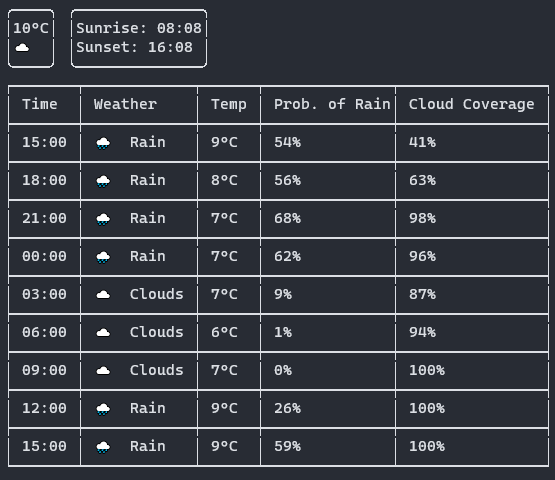

# Metty

Metty is a CLI weather tool. Weather data is retrieved from https://openweathermap.org/.



## How to build

The project can be built by running the `build` task using the gradle wrapper.

```bash
./gradlew build
```
## How to run

After building the project you can run the application using the `metty.sh` script.

```bash
./metty.sh southampton
```

The application requires the Open Weather API key to be provided as an environment variable called `OPEN_WEATHER_API_SECRET`. You can request an API key from https://openweathermap.org/. 
